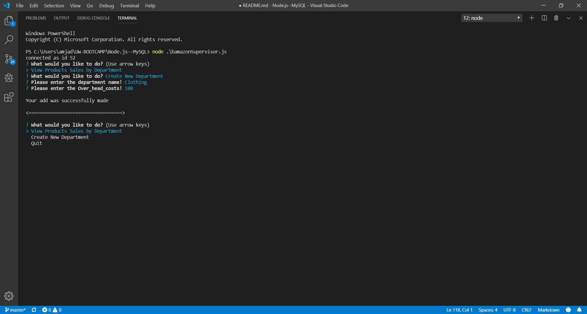

# Node.js--MySQL

## Overview

This app will take in orders from `customers`, `managers` and `supervisors`. The customers will be able to view and buy products, managers will manage the stock and the store's inventory, supervisers will be able to track product sales across the store's departments and then provide a summary of the highest-grossing departments in the store.

## How to use

`Node.js--MySQL` is a command line node app that takes in parameters and gives you back data. So all users will be able to use it through the terminal.

```r
# For Customers
```

In your terminal type this command
```javascript
node bamazonCustomer.js
```


Then you should have this screen below that shows a menu that you can choose from. The first option is `Buy Products` which will allow you to see and buy products, otherwise if you choose `Quit` it will quit the program.


If you choose `Buy Products`, a table of all the products will show, and a menu that will enable you to buy a product; the first question will ask you about the `item_id` that you want to buy in the example below `item_id ==> 3` is selected, and then it will ask you how many `items` you want to buy, in the example `4 items` are selected.


After entering an `item_id` and `quantity` in the menu above, if the stock has enough products, it will tell you that your purchase was made and show you the total. 


If the stock has not enough products, it will give you a message telling you `Insufficient quantity! Please try again later`.


```r
# For Managers
```


In your terminal type this command
```javascript
node bamazonManager.js
```


Then you should have this screen below that shows a menu with five options:

* `View Products for Sale`
* `View Low Invetory`
* `Add to Inventory`
* `Add New Product`
* `Quit`


 If you choose `Quit` it will quit the program. The first option is `View Products for Sale` which will allow you to see all the information about the products in the inventory. 


 If you choose The second option is `View Low Invetory` which will allow you to see all the information about the low products in the inventory, it will show every item that has `quantity <= 5`.

  

The third option in the menu is `Add to Inventory` which will allow you to add items to a specific product in the inventory, that means increasing the quantity of the product. After choosing this option, another menu will popup with tow questions:

* Please enter the item_id of the product you would like to add!, in the example `item_id => 5` is used.
* How many of the product you would like to add? and in the example a `quantity` of `100` is used.

  

After adding to a product a message will appear and tell you that `Your add was successfully made`.

  

The fourth option in the menu is `Add New Product` which will allow you to add a new product to the inventory. After choosing this option, another menu will popup with four questions:

* Please enter the item name!, in the example `PlayStation` is used.
* Please enter the department name!, in the example `Electronics` is used.
* Please enter the item price!, in the example `350` is used.
* Please enter the item quantity!, in the example `50` is used.

  

After adding a new product, a message will appear and tell you that `Your add was successfully made`.

  


```r
# For Supervisors
```


In your terminal type this command
```javascript
node bamazonSupervisor.js
```


Then you should have this screen below that shows a menu with three options:

* `View Products Sales by Department`
* `Create New Department`
* `Quit`


 If you choose `Quit` it will quit the program. The first option is `View Products Sales by Department` which will allow you to see all the product sales across the store's departments. 


The second option in the menu is `Create New Department` which will allow you to create a new department to the inventory. After choosing this option, another menu will popup with four questions:

* Please enter the department name!, in the example `Clothing` is used.
* Please enter the Over_head_costs!, in the example `100` is used.

  

After adding a new department, a message will appear and tell you that `Your add was successfully made`.

  


  

## Link
https://github.com/AmjedAyoub/Node.js--MySQL

## Technologies
* node.js
* mysql